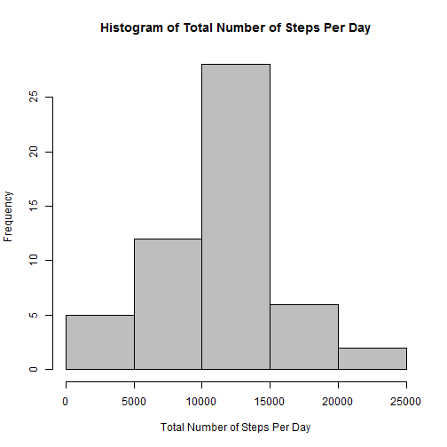
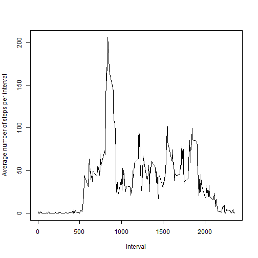
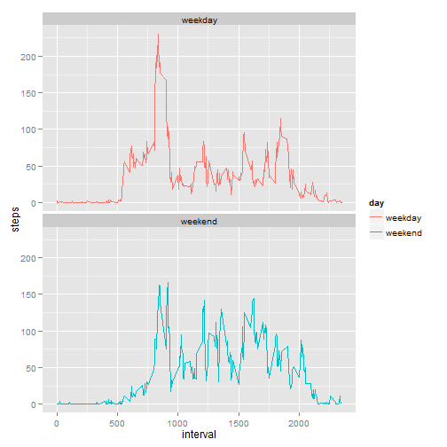

Reproducible Research: Peer Assessment 1
===============================================

Loading and preprocessing the data
-----------------------------------

```r
if(!file.exists('activity.csv')){
    unzip('activity.zip')
}
data <- read.csv('activity.csv')
```

What is mean total number of steps taken per day?
-------------------------------------------------------

```r
library(plyr)
sub <- ddply(data, .(date), summarize, steps = sum(steps))
mean <- mean(sub$steps, na.rm = TRUE)
median <- median(sub$steps, na.rm = TRUE)
hist(sub$steps, xlab = "Total Number of Steps Per Day", main="Histogram of Total Number of Steps Per Day", col ="grey")
```

 

After removing the records having missing values, the mean total number of steps per day is 10766 and the median is 10765.

What is the average daily activity pattern?
-----------------------------------------------

```r
sub2 <- ddply(data, .(interval), summarize, steps = mean(steps, na.rm=TRUE))
max1 <- max(sub2$steps)
max2 <- sub2[sub2$steps==max(max1),1]
plot(sub2$interval,sub2$steps, ylab="Average number of steps per interval",xlab="Interval", main=NULL, type="l")
```

 

On average across all the days in the dataset, the 5-minute interval, 835, contains the maximum number of steps.

Imputing missing values
--------------------------
There are many records having missing values. All of the missing values are filled in with mean of that 5-minute interval.

```r
fillvalue <- function(steps, interval) {
    filled <- NA
    if (!is.na(steps))
        filled <- c(steps)
    else
        filled <- (sub2[sub2$interval==interval, "steps"])
    return(filled)
}
datafilled <- data
datafilled$steps <- mapply(fillvalue, datafilled$steps, datafilled$interval)
```

After filling missing values, let's make a histogram of the total number of steps taken each day and calculate the mean and median total number of steps.

```r
subfilled <- ddply(datafilled, .(date), summarize, steps = sum(steps))
meanfilled <- mean(subfilled$steps, na.rm = TRUE)
medianfilled <- median(subfilled$steps, na.rm = TRUE)
hist(sub$steps, xlab = "Total Number of Steps Per Day", main="Histogram of Total Number of Steps Per Day with Filled Missing Values", col ="grey")
```

 

With filled values, the mean total number of steps per day is 10766 and the median is 10766.

Are there differences in activity patterns between weekdays and weekends?
--------------------------------------------------------------------------
Using the dataset with the filled-in missing values, let's create a new factor variable in the dataset with two levels - "weekday" and "weekend" indicating whether a given date is a weekday or weekend day.


```r
week <- function(date) {
    day <- weekdays(date)
    if (day %in% c("Monday", "Tuesday", "Wednesday", "Thursday", "Friday"))
        return("weekday")
    else if (day %in% c("Saturday", "Sunday"))
        return("weekend")
    else
        stop("Not valid")
}
datafilled$date <- as.Date(datafilled$date)
datafilled$day <- sapply(datafilled$date, FUN=week)
datafilled$day <- as.factor(datafilled$day)
#head(datafilled)
```

Let's plot of the average number of steps taken each interval during weekends and weekdays.


```r
sub3 <- ddply(datafilled, .(interval, day), summarize, steps = mean(steps, na.rm=TRUE))
```

```r
max3 <- max(sub3$steps)
max4 <- sub3[sub3$steps==max(max3),1]
library(ggplot2)
ggplot(data=sub3, aes(x=interval, y=steps, group=day)) + geom_line(aes(color=day))+ facet_wrap(~ day, nrow=2)
```

 


